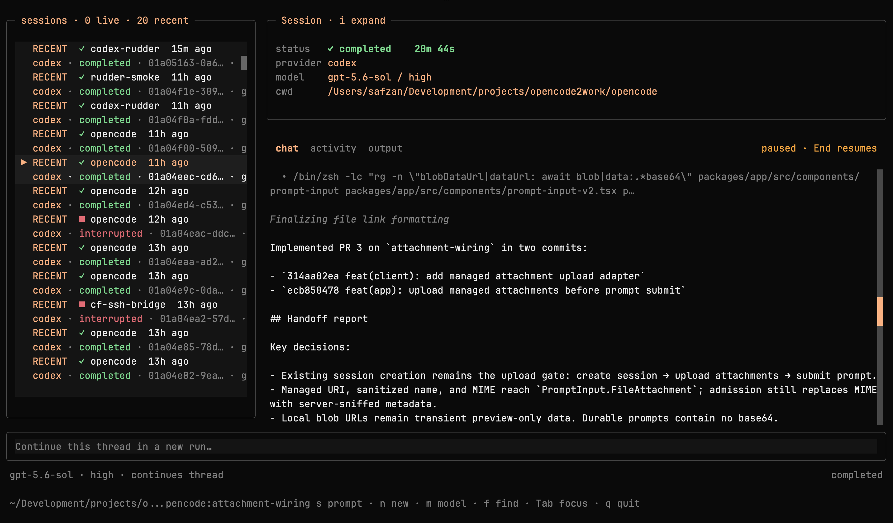

# Rudder

**A control plane for agents that run other agents.**

Rudder is a small CLI that keeps a live handle on long-running Codex, Claude
Code, OpenCode 2, and Pi sessions. An orchestrating agent launches a turn in
the background, reads its progress from plain files, and redirects it mid-flight
over a local socket — no waiting for it to finish, no killing it and starting
over. Every command works the same from a human shell, so a person can watch or
steer too, but the primary operator is another agent.



```bash
rudder run --prompt-file task.md --state-dir run &   # start a turn
rudder peek --state-dir run                          # watch it think
rudder steer --state-dir run "tests first, skip the benchmark"
rudder tui                                           # every session, live
```

## Why?

Agent harnesses increasingly delegate: one agent plans, spawns a coding agent
for the long turn, and keeps working while it runs. `codex exec --json` breaks
that loop — it is observable, but its stdin closes after the initial prompt, so
the orchestrator can only wait for the turn or kill it. Both waste the work
already done, and mid-flight discoveries (a wrong assumption, new user input, a
better plan) cannot reach the running turn.

Rudder instead owns the provider connection and exposes a small local control
socket, so any later command — issued by the orchestrating agent, a cron job,
or a human — can steer the turn that is already in flight.

Agent-first by construction:

- **State is plain files** (`state.json`, `events.jsonl`, `output.md`) — an
  orchestrator polls or tails them without a TTY.
- **Commands speak JSON** where metadata matters (`rudder thread ...`), so
  skills and scripts consume results without scraping.
- **Steering is just another CLI call** against the socket, safe to issue from
  a background task; it fails loudly if the turn is gone rather than starting a
  replacement.
- The TUI and human steering sit on top of the same contract, as the optional
  layer.

Providers:

- **Codex** — Rudder owns a `codex app-server` connection and calls `turn/steer`
  on the running turn.
- **Claude Code** — Rudder runs a small Bun adapter over the official Claude
  Agent SDK. Its persistent streaming-input queue makes steering part of the
  same live session, and structured SDK events expose summarized reasoning,
  assistant updates, and tool lifecycle to the same TUI used for Codex.
- **OpenCode 2** — Rudder runs a private v2 server and uses its durable session
  inbox. Steering uses `delivery: "steer"` on the active session.
- **Pi** — Rudder runs Pi in JSONL RPC mode. Pi exposes native steering,
  interruption, session persistence, streamed tool events, and usage totals.

All providers use the same state directory, commands, and TUI.

```text
task launcher ──stdio JSON-RPC──> provider app-server or adapter
      │
      ├── state.json / events.jsonl / trace.log / output.md
      │
      └── local Unix socket <── rudder steer "focus on the failing test first"
```

The name is literal: Rudder does not replace the engine, model, or auth
provider. It changes the heading of an in-flight turn.

## Status

Early working prototype. Each provider protocol evolves quickly. Reverify
Rudder after provider upgrades. OpenCode support targets the 2.0 preview CLI
through `opencode2` or `opencode-next`. Rudder does not support OpenCode 1 yet.

Adding a provider means implementing one adapter behind the existing
`--provider` flag. The state directory, control socket, steering commands, and
TUI are provider-agnostic already.

## Build

```bash
bun install
go build -o rudder .
```

Requires Go 1.24 and Bun 1.4 or newer. Codex runs require a CLI with
`codex app-server` and `turn/steer` support; that command surface is verified
against `codex-cli 0.145.0`. Claude runs use the pinned official Claude Agent
SDK and the caller's normal Claude Code authentication. OpenCode runs require
the `opencode2` or `opencode-next` executable.

Pi runs require the `pi` executable with RPC mode. The adapters inherit each
CLI's normal authentication environment.

## Run a task

Create a self-contained prompt and a run directory:

```bash
mkdir -p .scratch/rudder-demo
$EDITOR .scratch/rudder-demo/prompt.md

./rudder run \
  --provider codex \
  --cwd "$PWD" \
  --prompt-file .scratch/rudder-demo/prompt.md \
  --state-dir .scratch/rudder-demo/run \
  --model gpt-5.6-sol \
  --sandbox workspace-write
```

`--provider` defaults to `codex`, so existing commands do not need to change.

Run Claude Code through the same control plane:

```bash
./rudder run \
  --provider claude \
  --cwd "$PWD" \
  --prompt-file .scratch/rudder-demo/prompt.md \
  --state-dir .scratch/rudder-demo/claude.run \
  --effort high \
  --sandbox workspace-write
```

Omit `--model` to use Claude Code's configured default. Use
`--claude-path /absolute/path/to/claude` when the executable is not normally
discoverable, or set `RUDDER_CLAUDE_PATH` to make that choice persistent;
`--claude-path` takes precedence. Point either at a wrapper script when your
Claude authentication depends on shell or Keychain setup that a detached
process does not inherit. `read-only` maps to Claude's `plan` mode.
`workspace-write` uses `acceptEdits` and enables Claude's command sandbox. It
automatically allows Bash only when Claude runs the command inside that
sandbox, adds the working directory to the writable paths, and fails if the
sandbox is unavailable. `danger-full-access` maps to `bypassPermissions`.
Rudder denies any operation that still requires interactive approval.

Run OpenCode 2 or Pi through the same surface:

```bash
./rudder run --provider opencode --cwd "$PWD" \
  --prompt-file .scratch/rudder-demo/prompt.md \
  --state-dir .scratch/rudder-demo/opencode.run

./rudder run --provider pi --cwd "$PWD" \
  --prompt-file .scratch/rudder-demo/prompt.md \
  --state-dir .scratch/rudder-demo/pi.run
```

The default model for both adapters is
`openrouter/deepseek/deepseek-v4-flash-vision-exp`. Use `--opencode-path` or
`RUDDER_OPENCODE_PATH` to select an OpenCode 2 executable. Use `--pi-path` or
`RUDDER_PI_PATH` to select a Pi executable. OpenCode installs private
Rudder-scoped agents with explicit permission rules for each sandbox value. Pi
disables extensions and enables only its read, grep, find, and list tools for
`read-only`. Both adapters use their provider's native permission system. They
do not provide Rudder-enforced filesystem containment for `workspace-write`.
Run these adapters only in trusted workspaces. OpenCode 2 loads project
configuration and plugins, and Pi loads project-local resources after approval.
Those resources can execute code outside the adapters' tool permission rules.

Run it in the background from an agent harness so the harness can continue
reading user messages and issue steering commands.

`--turn-timeout` defaults to one hour and stops a silently hung turn and its
child process group. Set it to `0` only when an unbounded run is intentional.
`SIGINT` and `SIGTERM` mark the run interrupted, terminate the app-server
process group, and remove the control socket before Rudder exits.

Resume an existing provider thread or session for another steerable turn:

```bash
./rudder run \
  --resume-thread THREAD_ID \
  --cwd "$PWD" \
  --prompt-file .scratch/rudder-demo/prompt.md \
  --state-dir .scratch/rudder-demo/resumed-run
```

Fork first when the new work should preserve the source thread:

```bash
./rudder run \
  --fork-thread THREAD_ID \
  --fork-before-turn TURN_ID \
  --cwd "$PWD" \
  --prompt-file .scratch/rudder-demo/prompt.md \
  --state-dir .scratch/rudder-demo/forked-run
```

Use `--fork-through-turn TURN_ID` instead to include the selected turn.

## Discover and manage Codex threads

`rudder thread` is Codex-specific. It prints the app-server result as JSON so
agent skills and shell scripts can consume pagination cursors and complete
metadata without scraping human-formatted output:

```bash
./rudder thread list --limit 20 --cwd-filter "$PWD"
./rudder thread search --limit 10 "parser regression"
./rudder thread read --include-turns THREAD_ID
./rudder thread turns --limit 20 THREAD_ID

./rudder thread fork --before-turn TURN_ID THREAD_ID
./rudder thread name THREAD_ID "Parser regression investigation"
./rudder thread archive THREAD_ID
./rudder thread unarchive THREAD_ID
```

Every thread subcommand also accepts a stdio-compatible child command after
`--`, using the same private auth-bridge composition as `rudder run`.

## Steer the active turn

```bash
./rudder steer \
  --state-dir .scratch/rudder-demo/run \
  "New information: the regression starts in parser.go. Focus there first."
```

The command fails if the turn is no longer active or the active turn ID does
not match. It never silently starts a replacement turn.

For exact multiline input:

```bash
./rudder steer --state-dir .scratch/rudder-demo/run \
  --message-file .scratch/rudder-demo/steer.md
```

## Idle sessions: multi-turn without new processes

`rudder run --idle` keeps the controller and provider alive after a turn
finishes. The run's status becomes `idle` and the control socket accepts new
turns on the same thread:

```bash
./rudder run --idle --prompt-file task.md --state-dir .scratch/demo/run &
./rudder wait  --state-dir .scratch/demo/run   # blocks through idle; Ctrl+C to stop watching
./rudder prompt --state-dir .scratch/demo/run "Now add tests for the fix."
./rudder stop   --state-dir .scratch/demo/run  # graceful shutdown while idle
```

Rules:

- `prompt` works only while the session is idle; `steer` works only while a
  turn is active. Neither command is ever converted into the other.
- `interrupt` during a turn returns an idle session to `idle` instead of
  killing the provider; `stop` ends an idle session gracefully.
- `--idle-timeout` (default 4h) exits the session after that long idle; the
  final persisted status is the last turn's terminal status.
- `--turn-timeout` applies per turn.
- `output.md` separates turns with `---`; each prompt is also recorded as a
  synthetic `userMessage` item in `events.jsonl` (private artifact) so the TUI
  can render a conversation.
- state.json gains `idle`, `turns`, and `tokenUsage` (cumulative counts,
  context window, and cost when the provider reports one). Prompt text still
  never reaches state.json.

`rudder models [--json]` prints the model catalog (providers, models, default
per provider) that the TUI's picker uses.

## Observe and control

```bash
./rudder status --state-dir .scratch/rudder-demo/run
./rudder status --state-dir .scratch/rudder-demo/run --json
./rudder peek --state-dir .scratch/rudder-demo/run -n 40
./rudder wait --state-dir .scratch/rudder-demo/run --timeout 20m
./rudder interrupt --state-dir .scratch/rudder-demo/run
```

For a live fullscreen view of several runs, install the CLI and its TUI assets
once, then launch the dashboard from any directory:

```bash
./scripts/install-local.sh
rudder tui
```

The dashboard shows live runs first, followed by the 20 most recent finished
runs from Rudder's private global registry. It also discovers `state.json` files
below `.scratch` in the directory where it was launched. New `rudder run`
commands register themselves automatically. Use `--all` for the full history,
or point it at extra locations with repeatable `--root DIR` and `--state-dir DIR`
arguments:

```bash
./rudder tui --root /path/to/project/.scratch
./rudder tui --state-dir /path/to/one/run --state-dir /path/to/another/run
./rudder tui --all
./rudder tui --theme tokyonight
./rudder tui --beta
```

The default TUI uses an at-a-glance dashboard. A persistent sessions pane shows
live and recent runs on the left. The right column shows session details, the
lowercase Chat, Activity, and Output tabs, and the selected artifact. The
prompt input spans the full width below the dashboard. Press `Tab` to switch
focus between the sessions pane and the selected artifact. Press `Esc` in the
sessions pane to return focus to the artifact.

Use `--beta` for the chat-first layout. `RUDDER_TUI_BETA=1` enables the same
layout. Beta mode shows one session's borderless conversation and keeps the
sessions list behind a `Tab` overlay. `Enter` or `Esc` closes that overlay.

Typing in the prompt input routes by session status. An active turn gets a
steer. An idle `--idle` session gets a new turn over the control socket. A
finished session continues its thread in a fresh run. The prompt metadata shows
the selected session's model, token usage, cost, and status. For example, it
can show `gpt-5.6-sol · 186.1K (24%) · idle`.

`n` starts a brand-new session. Pick a provider and model in the T3-style
picker, type the first prompt,
and the TUI spawns a detached `rudder run --idle` in the current directory.
`m` opens the same picker to override the model for continuations. When the
`deja` CLI is installed, `f` searches past Claude/Codex transcripts and resumes
a chosen session under rudder.

`/` filters by project, thread, status, or model when the sessions pane has
focus. `/` searches the selected artifact when the artifact has focus. Chat,
Activity, and Output are clickable tabs (`o` cycles). Both panes support
mouse-wheel scrolling, `/` search with `n`/`N` match navigation, and `c` to copy
the selected row. In Activity, clicking selects a row and clicking a tool row
expands it; use the Output tab for normal mouse text selection. Enter also
expands Activity tool rows to show the full command, status, duration, working
directory, and captured output. Scrolling up
pauses follow mode; click the follow indicator or press End to return to live
output. Classic mode shows compact session metadata by default. Press `i` to
cycle through expanded, hidden, and compact metadata. Beta mode starts with
metadata hidden and uses the same cycle.

Press `t` to open the theme picker. Moving through the list previews each
palette immediately; Enter saves the choice globally and Escape restores the
previous palette. Rudder includes the 33 built-in OpenCode themes (using their
dark variants) alongside its original theme. `--theme NAME` or
`RUDDER_TUI_THEME=NAME` overrides the saved choice for one launch.

For an active run, `s` focuses the prompt box to steer and `x x` interrupts
(an idle session returns to idle; `x x` on an idle session ends it). For a
finished run, `s` or `shift+R` continues the same provider thread/session in a
fresh private run while preserving its working directory, model, effort, and
sandbox. `r` refreshes, `i` toggles the session details panel, and `q` exits.
State and
artifacts otherwise refresh every 500ms; override that with a duration such as
`--interval 2s`.

`rudder tui` requires Bun 1.4 or newer and the optional `@opentui/core`
dependency. The installer places the binary in `~/.local/bin` and the TUI in
`~/.local/share/rudder` by default; both locations honor the standard
`RUDDER_BIN_DIR` and `XDG_DATA_HOME` overrides. The launcher also finds a TUI
beside the binary or in the current checkout. For custom development paths, set
`RUDDER_TUI_ENTRY`, `RUDDER_CLAUDE_ADAPTER_ENTRY`,
`RUDDER_OPENCODE_ADAPTER_ENTRY`, or `RUDDER_PI_ADAPTER_ENTRY`. Legacy
`CODEX_RUDDER_*` variables and installed assets remain readable.

Run artifacts:

- `state.json` — IDs, status, paths, and timestamps; no prompt or output text.
- `events.jsonl` — raw provider protocol events.
- `trace.log` — compact human-readable progress.
- `output.md` — all completed `agentMessage` items in order.
- `provider.stderr.log` — child diagnostics (legacy runs retain their persisted
  `app-server.stderr.log` path).

The run directory and all files are owner-only (`0700` / `0600`). The control
socket lives inside that directory when the Unix path limit permits; otherwise
Rudder creates a random owner-only temporary parent and records it in state.
The raw events, trace, and output can contain prompt, command, and completion
content. Persisted errors in `state.json` are generic; details remain in the
private trace and stderr logs.

The global run registry stores only private state-directory references under
`~/.local/state/rudder/runs` (or `XDG_STATE_HOME`). It does not duplicate
prompt, trace, output, or authentication content.
The TUI also reads the legacy `codex-rudder/runs` registry so existing history
does not disappear.

If a process is killed without cleanup, `status` renders a non-terminal state
as `stale`, while `wait`, `steer`, and `interrupt` fail promptly instead of
polling forever or returning an opaque socket error.

## Layer over codex-auth-broker

Rudder accepts any stdio-compatible app-server command after `--`. This lets
the existing auth bridge keep ownership of OAuth refresh while Rudder adds
lifecycle and steering:

```bash
./rudder run \
  --cwd "$PWD" \
  --prompt-file .scratch/rudder-demo/prompt.md \
  --state-dir .scratch/rudder-demo/run \
  --model gpt-5.6-sol \
  --sandbox workspace-write \
  -- \
  /Users/safzan/Development/projects/codex-auth-broker-private/codex-auth-broker \
    app-server-bridge \
    -broker-auth-url http://100.121.157.57:8765/v1/codex/auth \
    -secret-file /Users/safzan/.codex/codex-auth-broker.secret
```

The process chain is:

```text
rudder
  └─ codex-auth-broker app-server-bridge
       └─ codex app-server --listen stdio://
```

Rudder never reads or persists the broker secret or Codex OAuth tokens. The
bridge consumes those and presents the same app-server JSON-RPC stream.

## Why not `codex exec resume`?

Resume adds a later turn after the current one completes. `turn/steer` appends
input to the currently in-flight regular turn, so Codex can change direction
after the current tool call and before it commits to a final answer.

Review and manual compaction turns can reject steering. `review-codex-auto`
should continue using a normal prompt-driven turn (not `review/start`) when it
needs the result to remain steerable.

## Protocol compatibility

The installed CLI can emit exact schemas for its version:

```bash
schema_dir=$(mktemp -d /tmp/codex-app-server-schema.XXXXXX)
codex app-server generate-json-schema --experimental --out "$schema_dir"
```

Treat those schemas as candidates, not a runtime capability guarantee. In
`codex-cli 0.145.0`, for example, the experimental schema advertises
`thread/items/list` while the initialized app-server returns JSON-RPC `-32601`
for that method. Probe a method against the installed runtime before depending
on it; Rudder intentionally does not expose `thread/items/list`.

Rudder currently depends on:

- `initialize` then `initialized`
- `thread/start`
- `thread/list`, `thread/search`, and `thread/read`
- `thread/turns/list`
- `thread/resume` and `thread/fork`
- `thread/name/set`, `thread/archive`, and `thread/unarchive`
- `turn/start`
- `turn/steer`
- `turn/interrupt`
- `turn/started`, `item/*`, and `turn/completed` notifications

The Claude, OpenCode 2, and Pi adapters implement the lifecycle subset needed
by `rudder run`, `steer`, `prompt`, and `interrupt`. They do not implement the
general Codex app-server surface. Sessions launched by another process do not
become live-observable through Rudder. Each adapter forwards summarized or
provider-exposed reasoning. Rudder does not expose hidden raw chain of thought.

## Agent setup guide

Hand this to Claude Code, Codex, Cursor, or any agent with shell access. It is
written to be pasted verbatim, and it covers both installing Rudder and
operating it afterwards, so the agent ends up able to run and steer provider
sessions, not just build a binary.

````text
Set up Rudder (https://github.com/safzanpirani/rudder) on this machine, verify
it works, and learn how to operate it. Rudder runs Codex, Claude Code,
OpenCode 2, or Pi as an observable, steerable child process. It writes every
event to
disk and exposes a control socket so you can redirect or stop a turn while it
runs. Follow Part 1 in order and stop at the first failure; keep Part 2 as your
operating manual.

PART 1 — INSTALL AND VERIFY

1. Check prerequisites. Report the version of each and stop if any is missing:
   - Go 1.24 or newer  (`go version`)
   - Bun 1.4 or newer  (`bun --version`)
   - At least one provider CLI: `codex --version`, `claude --version`,
     `opencode2 --version`, or `pi --version`.

2. Clone the repo somewhere sensible and build it:
   git clone https://github.com/safzanpirani/rudder
   cd rudder
   bun install
   go build -o rudder .

3. Run the test suite and stop if anything fails:
   go test ./...
   go vet ./...
   bun test
   bunx tsc -p tsconfig.json --noEmit

4. Install it onto PATH:
   ./scripts/install-local.sh
   Then confirm `rudder --help` runs from a directory other than the repo.

5. Smoke-test a real turn. Create a scratch prompt that asks the provider to
   reply with exactly SMOKE_OK, then:
   rudder run --provider codex --cwd /tmp/rudder-smoke/ws \
     --prompt-file /tmp/rudder-smoke/prompt.md \
     --state-dir /tmp/rudder-smoke/run --sandbox read-only
   rudder peek --state-dir /tmp/rudder-smoke/run
   Confirm `rudder status --state-dir /tmp/rudder-smoke/run --json` reports
   "completed" and that output.md contains SMOKE_OK.

6. If you are setting up the Claude provider and it reports an authentication
   failure, the cause is almost always that the resolved `claude` executable
   cannot reach its credentials from a detached process. Do not put any token
   into Rudder. Instead point Rudder at the wrapper or launcher that does work
   interactively, using `--claude-path` or `RUDDER_CLAUDE_PATH`.

7. Report what you installed, where the binary landed, which providers
   authenticated, and the exact output of any step that failed. Do not modify
   my shell configuration without telling me what you changed.

PART 2 — HOW TO OPERATE RUDDER

Core model. One `rudder run` owns one provider session. You choose a
--state-dir; everything about the run lands there:
   state.json      status, thread/turn IDs, token usage — never prompt text
   events.jsonl    every raw provider event, append-only
   trace.log       human-readable activity trace
   output.md       completed agent messages, in order
Trust output.md only when `rudder status --json` says "completed"; on
"failed" or "interrupted" report the error field instead. The state dir must
be fresh per run. Prompts always come from --prompt-file, never argv.

Starting runs. Useful `rudder run` flags:
   --provider codex|claude|opencode|pi   default codex
   --model / --effort           `rudder models --json` lists valid combos
   --sandbox                    read-only | workspace-write (default) |
                                danger-full-access
   --cwd DIR                    the workspace the provider edits
   --turn-timeout 1h            per-turn watchdog; 0 disables
Long runs: launch in the background (or your harness's background mode), then
watch with `rudder peek --state-dir DIR -n 25` and block bounded with
`rudder wait --state-dir DIR --timeout 30m`. Never poll in a foreground loop.

Steering. While a turn is active you can redirect it without restarting:
   rudder steer --state-dir DIR "the correction, exact literals preserved"
   rudder steer --state-dir DIR --message-file FILE   (multiline/shell-unsafe)
Use steer when new information arrives mid-turn. To abort a wrong-premise turn
use `rudder interrupt --state-dir DIR`, never kill -9. A rejected steer means
the turn already ended — read the output; do not silently start a new run.

Multi-turn (idle) sessions. Add --idle to `rudder run` and the process stays
alive after each turn instead of exiting:
   rudder prompt --state-dir DIR "next task"    starts the next turn
   rudder stop   --state-dir DIR                graceful shutdown
   --idle-timeout 4h                            auto-exit when unused
status "idle" means ready for the next prompt; "active" means a turn is
running (steer, don't prompt). Prompt and steer are different commands with
different semantics — never substitute one for the other. Use idle mode when
you expect follow-up turns: it keeps one process and one thread instead of
spawning a fresh run per message.

Continuing past work. Threads persist in the provider's own store:
   rudder thread list --cwd-filter "$PWD"       recent threads for this repo
   rudder thread search "keywords"              global search — verify cwd
   rudder thread read --include-turns ID        inspect before resuming
   rudder run --resume-thread ID ...            continue a thread in a new run
   rudder run --fork-thread ID ...              branch it, preserving original
Verify a candidate thread's cwd and content before resuming; never resume or
fork a thread whose turn is still active.

Watching everything at once. `rudder tui` shows a dashboard of live and
recent sessions with a prompt box: type to steer an active turn, prompt an
idle one, or continue a finished thread; `n` starts a new session, `m` picks
the model, `x x` stops. `rudder tui --beta` switches to a chat-first layout.

Ground rules:
- Report token usage/cost from `rudder status --json` when the human asks
  what a run cost.
- state.json is intentionally content-redacted; never write prompt or
  completion text into it or rely on it being there.
- One state dir, one run, ever. New run, new dir.
````

## Agent skill: delegate work through Rudder

[`skills/rudder-delegate`](skills/rudder-delegate/SKILL.md) is an installable
agent skill that teaches a coding agent to hand a hard or long task to a
steerable provider through Rudder: build a self-contained
brief, launch in the background, monitor, steer mid-turn, wait bounded, and
verify the handoff. Install it by copying the directory into your agent's
skills location (for Claude Code, `~/.claude/skills/` or the project's
`.claude/skills/`).

## Development

```bash
gofmt -w *.go
go test ./...
go vet ./...
go build -o rudder .
bun test
bunx tsc -p tsconfig.json --noEmit
```
